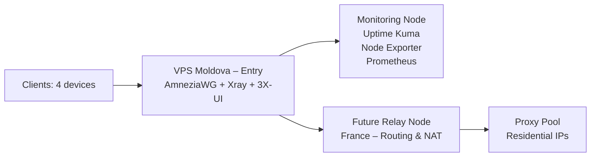

# Multi-Hop VPN Infrastructure

)

---

## Table of Contents
- [Project Overview](#project-overview)
- [Architecture](#architecture)
- [Current Status](#current-status-)
- [Tech Stack](#tech-stack)
- [Key Features](#key-features)
- [Next Steps](#next-steps)
- [Setup](#setup)
- [Scripts](#scripts)
- [Troubleshooting](#troubleshooting)
- [Automation](#automation)
---

## Project Overview
Multi-hop VPN infrastructure for stable, private connectivity, designed to bypass DPI restrictions and provide monitoring and failover capabilities.

---

## Architecture

---

## Current Status ✅
- VPS1 configured and running (Moldova)
- VPN tunnel (AmneziaWG) established
- Config files created for 6 clients
- Monitoring setup:
    - Uptime Kuma + Telegram alerts
    - Node Exporter + Prometheus (metrics)
    - Custom script for AmneziaWG UDP:443 check

---

## Tech Stack
- **Networking**: WireGuard, AmneziaWG
- **Infrastructure & Automation**:
  - **VPS lifecycle**: Python + Aeza REST API (custom script, planned)
  - **Configuration management**: Ansible (planned)
- **Monitoring**: Prometheus, Node Exporter, Uptime Kuma
- **Scripting**: Bash, Python

---

## Key Features
- DPI bypass via obfuscation layer
- Multi-client VPN configuration
- Observability with metrics and alerts
- Failover testing scripts

## Next Steps
- Rent a second VPS in France (Aeza), install AmneziaWG, and establish an exit tunnel (entry → exit).
- Automate VPS lifecycle: write a Python script to manage Aeza instances via their REST API.
- Automate server configuration: write Ansible playbooks for AmneziaWG, Xray, and monitoring.
- Expand Grafana dashboards for better observability.
- Implement a proxy pool for fault tolerance (fallback exit IPs).

## Setup
See [docs/setup-tutorial.md](docs/setup-tutorial.md)

## Scripts

Utility scripts to automate common tasks. All scripts are located in the [`scripts/`](scripts/) directory and require execution on the VPS with appropriate permissions.

| Script | Description |
|--------|-------------|
| [`rotate-keys.sh`](scripts/rotate-keys.sh) | Generate new keys for an existing AmneziaWG client, update the server config, and restart the service. |
| [`backup-configs.sh`](scripts/backup-configs.sh) | Create a timestamped archive of all critical configuration files (AmneziaWG, Xray, monitoring). |
| [`install-monitoring.sh`](scripts/install-monitoring.sh) | Deploy the full monitoring stack (Uptime Kuma, Prometheus, Node Exporter, Alertmanager) via Docker on a fresh VPS. |
| [`deploy-client.sh`](scripts/deploy-client.sh) | Wrapper around the AmneziaWG installer to create a new client and print its configuration. |
| [`healthcheck.sh`](scripts/healthcheck.sh) | Verify the status of AmneziaWG, Xray, and essential ports. Returns exit code 0 if all healthy. |
| [`setup-new-vps.sh`](scripts/setup-new-vps.sh) | Perform base setup on a new VPS: create a user, configure SSH keys, disable password authentication, set up firewall. |
| [`check_awg.sh`](scripts/check_awg.sh) | Monitor AmneziaWG health and push status to Uptime Kuma (used in cron). |
| [`install-amneziawg.sh`](scripts/install-amneziawg.sh) | One‑click installation of AmneziaWG on a fresh Ubuntu server (based on the official installer). |

All scripts are provided as examples – adjust variables, paths, and placeholders to match your environment. Run them with `sudo` where required.

## Troubleshooting

### Real-World Challenge

During testing, I encountered mobile network restrictions where only whitelisted websites were accessible.

This project includes troubleshooting and analysis of:
- DPI filtering behavior
- UDP traffic instability
- VPN protocol blocking

See details in [docs/troubleshooting.md](docs/troubleshooting.md)

## Automation (planned)

The project is migrating from Timeweb to **Aeza** for the exit node.  
Because Aeza does not have an official Terraform provider, a custom Python script will be created to manage VPS lifecycle via their REST API.  
The script will be placed in `scripts/` and documented in `terraform/README.md`.

All server configuration (AmneziaWG, monitoring) will still be handled by **Ansible** (playbooks in `ansible/`).
