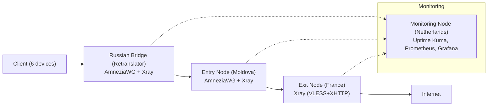

# Multi-Hop VPN Infrastructure

)

---

## Table of Contents
- [Project Overview](#project-overview)
- [Architecture](#architecture)
- [Current Status](#current-status-)
- [Tech Stack](#tech-stack)
- [Key Features](#key-features)
- [Next Steps](#next-steps)
- [Setup](#setup)
- [Automation and Scripts](#automation-and-scripts)
- [Troubleshooting](#troubleshooting)

---

## Project Overview
Multi-hop VPN infrastructure for stable, private connectivity, designed to bypass DPI restrictions and provide monitoring and failover capabilities.

---

## Architecture

The infrastructure is designed as a multi‑hop chain to bypass DPI and whitelist‑based filtering.  
Traffic flows from the client through a **Russian bridge node**, then to the **entry node** in Moldova, and finally to the **exit node** in France.  
A separate **monitoring node** (Netherlands) collects metrics and sends alerts.

---

## Current Status ✅
- VPS1 configured and running (Moldova)
- VPN tunnel (AmneziaWG) established
- Config files created for 9 clients
- Monitoring setup:
    - Uptime Kuma + Telegram alerts
    - Node Exporter + Prometheus (metrics)
    - **Python script** (`awg_status.py`) collects AmneziaWG metrics (peers, traffic, handshake) and pushes to Uptime Kuma

---

## Tech Stack
- **Networking**: WireGuard, AmneziaWG
- **Monitoring**: Prometheus, Node Exporter, Uptime Kuma
- **Automation**: Python (Aeza, 4VPS.SU API), Ansible (in progress)
---

## Key Features
- DPI bypass via obfuscation layer
- Multi-client VPN configuration
- Observability with metrics and alerts
- Failover testing scripts

## Next Steps
- Provision exit node in France (Aeza) using Python script.
- Obtain Russian VPS (4VPS.SU or alternative) and set up bridge role.
- Configure Xray chain: RU bridge → Moldova entry → France exit.
- Migrate monitoring to a separate VPS (Netherlands).
- Write Ansible playbooks to automate the entire deployment.

## Setup
See [docs/setup-tutorial.md](docs/setup-tutorial.md)

## Automation and Scripts

### Current automation

Utility scripts are organised in the [`scripts/`](scripts/) directory:

| Script | Description |
|--------|-------------|
| **Maintenance** | |
| [`rotate-keys.sh`](scripts/maintenance/rotate-keys.sh) | Generate new keys for an existing AmneziaWG client, update the server config, and restart the service. |
| [`backup-configs.sh`](scripts/maintenance/backup-configs.sh) | Create a timestamped archive of all critical configuration files (AmneziaWG, Xray, monitoring). |
| **Monitoring** | |
| [`healthcheck.sh`](scripts/monitoring/healthcheck.sh) | Verify the status of AmneziaWG, Xray, and essential ports. Returns exit code 0 if all healthy. |
| [`awg_status.py`](scripts/monitoring/awg_status.py) | Python script to collect AmneziaWG metrics (peers, traffic, handshake age) and push to Uptime Kuma. Copy to `/usr/local/bin/awg_status.py` and replace placeholders. |
| **Setup** | |
| [`install-monitoring.sh`](scripts/setup/install-monitoring.sh) | Deploy the full monitoring stack (Uptime Kuma, Prometheus, Node Exporter, Alertmanager) via Docker on a fresh VPS. |
| [`setup-new-vps.sh`](scripts/setup/setup-new-vps.sh) | Perform base setup on a new VPS: create a user, configure SSH keys, disable password authentication, set up firewall. |
| [`install-amneziawg.sh`](scripts/setup/install-amneziawg.sh) | One‑click installation of AmneziaWG on a fresh Ubuntu server (based on the official installer). |
| **Provider automation** | |
| [`create_aeza_vps.py`](scripts/providers/aeza/create_aeza_vps.py) | Python script to provision a VPS on Aeza (France exit node) using their official API. |
| [`create_vps.py`](scripts/providers/fourvps/create_vps.py) | Python script to provision a VPS on 4VPS.SU (Russian bridge node) – requires API token and correct DC/tariff IDs (discovery mode included). |

> **Provider automation**: The scripts in `providers/` use each hoster's API to create VPS programmatically.  
> They are the first step towards full Infrastructure as Code (IaC) for this project.

### Planned automation

- **Ansible playbooks** for configuring AmneziaWG, Xray, and monitoring on all nodes (see `ansible/` directory).
- **CI/CD** (GitHub Actions) for automated testing of scripts and playbooks (planned).
- **Terraform** (optional) – if a provider with official Terraform support is chosen in the future.

All server configuration will be handled by Ansible, making the setup repeatable and version‑controlled.

## Troubleshooting

### Real-World Challenge

During testing, I encountered mobile network restrictions where only whitelisted websites were accessible.

This project includes troubleshooting and analysis of:
- DPI filtering behavior
- UDP traffic instability
- VPN protocol blocking

See details in [docs/troubleshooting.md](docs/troubleshooting.md)
