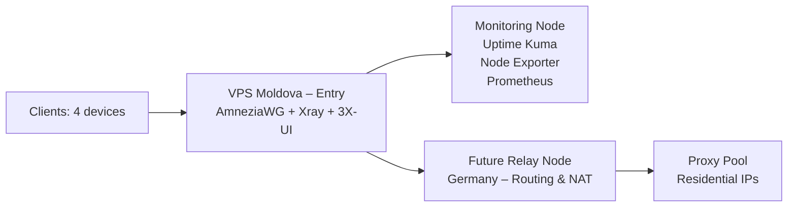

# Multi-Hop VPN Infrastructure

)

---

## Table of Contents
- [Project Overview](#project-overview)
- [Architecture](#architecture)
- [Current Status](#current-status-)
- [Tech Stack](#tech-stack)
- [Key Features](#key-features)
- [Next Steps](#next-steps)
- [Setup](#setup)
- [Troubleshooting](#troubleshooting)

---

## Project Overview
Multi-hop VPN infrastructure for stable, private connectivity, designed to bypass DPI restrictions and provide monitoring and failover capabilities.

---

## Architecture

---

## Current Status ✅
- VPS1 configured and running (Moldova)
- VPN tunnel (AmneziaWG) established
- Config files created for 4 clients
- Monitoring setup:
    - Uptime Kuma + Telegram alerts
    - Node Exporter + Prometheus (metrics)
    - Custom script for AmneziaWG UDP:443 check

---

## Tech Stack
- **Networking**: WireGuard, AmneziaWG
- **Infrastructure & Automation**: Terraform (planned), Ansible (planned)
- **Monitoring**: Prometheus, Node Exporter, Uptime Kuma
- **Scripting**: Bash

---

## Key Features
- DPI bypass via obfuscation layer
- Multi-client VPN configuration
- Observability with metrics and alerts
- Failover testing scripts

## Next Steps
- Add Relay Node in Germany
- Automate deployment via Terraform + Ansible
- Expand Grafana dashboards
- Implement proxy pool for failover

## Setup
See [docs/setup-tutorial.md](docs/setup-tutorial.md)

## Troubleshooting

### Real-World Challenge

During testing, I encountered mobile network restrictions where only whitelisted websites were accessible.

This project includes troubleshooting and analysis of:
- DPI filtering behavior
- UDP traffic instability
- VPN protocol blocking

See details in [docs/troubleshooting.md](docs/troubleshooting.md)
