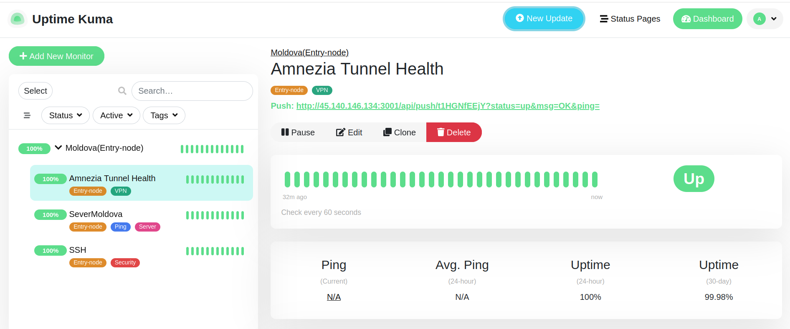
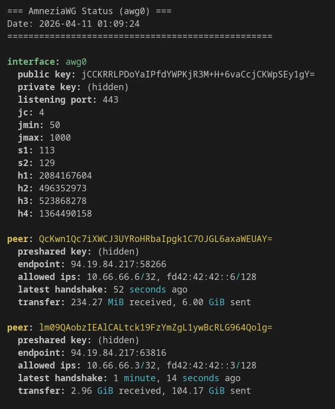

# Multi-Hop Obfuscated VPN Infrastructure

---

**Censorship-resistant multi-hop VPN** with Policy-Based Routing, AmneziaWG and Xray.

---

## Table of Contents
- [Project Overview](#project-overview)
- [Architecture](#architecture)
- [Current Status](#current-status-)
- [Tech Stack](#tech-stack)
- [Key Features](#key-features)
- [Next Steps](#next-steps)
- [Setup](#setup)
- [Automation and Scripts](#automation-and-scripts)
- [Troubleshooting](#troubleshooting)

---

## Project Overview
Multi-hop VPN infrastructure for stable, private connectivity, designed to bypass DPI restrictions and provide monitoring and failover capabilities.

---

## Architecture

See detailed architecture in [`docs/architecture.md`](docs/architecture.md).

---

## Current Status (as of April 08, 2026) ✅

| Component                    | Status              | Details |
|-----------------------------|---------------------|-------|
| **Moldova Entry Node**      | Fully Operational   | Main working node, serving active clients |
| **Russian Bridge Node**     | In Provisioning     | Waiting for clean IP from provider |
| **France Exit Node**        | Ready               | Deployment script prepared |
| **VPN Tunnel**              | Operational         | AmneziaWG + Xray multi-hop chain |
| **Client Configurations**   | 10+ clients         | Generated and tested |
| **Policy-Based Routing**    | Implemented         | Selective routing logic developed and tested |
| **Monitoring Stack**        | Active              | Uptime Kuma + Prometheus + Grafana (hosted on Moldova) |
| **Alerts**                  | Working             | Telegram notifications configured |
| **Custom Metrics**          | Developed           | `awg_status.py` collects AmneziaWG metrics and pushes to Uptime Kuma |

## Monitoring & Live Status

| Uptime Kuma Dashboard | AmneziaWG Status |
|----------------------|------------------|
|  |  |

*Current monitoring overview and real-time AmneziaWG tunnel status showing active peers and traffic.*

**Key Features:**
- Three-hop chain (Russia → Moldova → France)
- Server-side Policy-Based Routing
- Strong obfuscation (AmneziaWG + Xray)
- Full automation (Ansible + Python)

---

## Tech Stack
- **Networking**: WireGuard, AmneziaWG
- **Monitoring**: Prometheus, Node Exporter, Uptime Kuma
- **Automation**: Python (Aeza, 4VPS.SU API), Ansible (in progress)
---

## Key Features
- DPI bypass via obfuscation layer
- Multi-client VPN configuration
- Observability with metrics and alerts
- Failover testing scripts

---

## Next Steps
- Provision Russian Bridge node on Yandex Cloud with Policy-Based Routing
- Migrate all clients from Moldova Entry node to the new Russian Bridge
- Prepare Moldova node for receiving and forwarding traffic from Russian Bridge
- Complete automation of VPS provisioning and base hardening
- Migrate monitoring stack to a dedicated VPS in the Netherlands
- Final audit and polishing of project documentation and structure

Detailed weekly plans and progress tracking are available in [`PROJECT-JOURNAL.md`](PROJECT-JOURNAL.md).

---

## Setup
See detailed setup instructions in [`docs/setup-tutorial.md`](docs/setup-tutorial.md).

---

## Automation and Scripts

All automation scripts are organized in the [`scripts/`](scripts/) directory with a clear separation of concerns.

### Script Overview

| Category              | Script                              | Description |
|-----------------------|-------------------------------------|-----------|
| **Installation**      | `install/install-amneziawg.sh`      | One-click installation of AmneziaWG on a fresh Ubuntu server |
| **Installation**      | `install/install-monitoring.sh`     | Deploy full monitoring stack (Uptime Kuma, Prometheus, Node Exporter, Alertmanager) via Docker |
| **Installation**      | `install/provision-new-vps.sh`      | Base setup for a new VPS: create user, configure SSH keys, harden security, set up firewall |
| **Monitoring**        | `monitors/awg-status.py`            | Collect AmneziaWG metrics (peers, traffic, handshake age) and push to Uptime Kuma |
| **Monitoring**        | `monitors/healthcheck.sh`           | Verify AmneziaWG, Xray and critical ports health |
| **Utilities**         | `utils/rotate-keys.sh`              | Rotate keys for an existing client and restart the service |
| **Utilities**         | `utils/backup-configs.sh`           | Create timestamped backup of all critical configuration files |
| **Utilities**         | `utils/generate-config.sh`          | Generate client configuration files |
| **Providers**         | `providers/aeza/create-aeza-vps.py` | Provision VPS on Aeza using official API |
| **Providers**         | `providers/fourvps/create-vps.py`   | Provision VPS on 4VPS.SU (supports discovery mode) |

> **Note**: Provider scripts allow programmatic VPS creation and are the foundation for full Infrastructure as Code (IaC) in this project.

For detailed usage instructions, see [`docs/setup-tutorial.md`](docs/setup-tutorial.md).

---

### Planned automation

- **Ansible playbooks** for configuring AmneziaWG, Xray, and monitoring on all nodes (see `ansible/` directory).
- **CI/CD** (GitHub Actions) for automated testing of scripts and playbooks (planned).
- **Terraform** (optional) – if a provider with official Terraform support is chosen in the future.

All server configuration will be handled by Ansible, making the setup repeatable and version‑controlled.

---

## Troubleshooting & Real-World Challenges

One of the main motivations behind this project was solving real connectivity problems in restrictive networks.

### Key Challenge Faced

During testing, mobile networks with strict **whitelist-based restrictions** were encountered — only pre-approved websites were accessible, while UDP traffic was heavily throttled or blocked.

This project addresses the following real-world issues:
- Deep Packet Inspection (DPI) behavior and protocol blocking
- UDP traffic instability on mobile networks
- Whitelist-based internet access limitations
- Multi-hop VPN stability under censorship conditions

Detailed analysis, solutions and lessons learned are documented in:

→ [`docs/troubleshooting.md`](docs/troubleshooting.md)