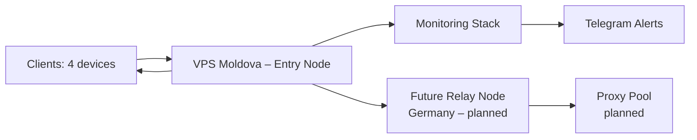

# Architecture

## 1. Introduction

This document describes the architecture of the VPN infrastructure designed to provide stable, private internet access in environments with DPI (Deep Packet Inspection) and possible network restrictions.

The system is built around a single entry node (VPS in Moldova) that runs multiple VPN protocols and a monitoring stack. The architecture is designed for modularity, making it easy to add exit nodes, automate deployment, and extend monitoring.

## 2. Current Architecture

The current setup consists of one VPS (entry node) located in Moldova. It serves multiple clients (currently 4 devices) and includes an observability stack for health checks and alerts.

### 2.1. High‑level diagram

### 2.2. Entry node (Moldova)

| Component | Purpose |
|-----------|---------|
| **AmneziaWG** | Main VPN protocol. Uses obfuscation (Jc, Jmin, Jmax, H1–H4) to avoid DPI detection. Listens on UDP/443. |
| **Xray + 3X‑UI** | Alternative protocol (VLESS+Reality) for environments where UDP is blocked. Listens on TCP/443. |
| **Uptime Kuma** | Simple uptime monitoring. Checks server availability (ping), SSH, Xray port, and receives push notifications from a custom script that verifies AmneziaWG status. |
| **Prometheus + Node Exporter** | Collects system metrics (CPU, memory, disk, network). |
| **Alertmanager** | Sends alerts to Telegram based on Prometheus rules (e.g., high CPU, low disk space, server down). |
| **Docker** | Runs monitoring stack (Prometheus, Node Exporter, Alertmanager, Uptime Kuma). |

### 2.3. Client connectivity
- AmneziaWG: Clients import a .conf file generated on the server. The config includes obfuscation parameters and MTU = 1280 for stability in mobile networks.
- Xray Reality: Clients (e.g., Hiddify) use a vless:// link obtained from 3X‑UI panel. This link contains the server address, port, UUID, and Reality settings.
- Both protocols can be used independently. The client chooses which one to activate based on network conditions.

### 2.4. Monitoring and alerts

- **Uptime Kuma**:
  - **Ping monitor** – checks if server is reachable.
  - **SSH port monitor** – ensures SSH is accessible.
  - **Xray port monitor** – verifies TCP/443 is open.
  - **Push monitor** – receives status from a cron script that runs `sudo awg show` every minute. If the script detects that AmneziaWG has no active handshake, it sends a `down` status; otherwise `up`.

- **Prometheus**:
  - Collects metrics from Node Exporter (host system).
  - Stores metrics, exposes them for queries and alerts.
  - Rules are defined in `alerts.yml` (e.g., CPU > 80% for 5 min, disk < 15% free).

- **Alertmanager**:
  - Receives alerts from Prometheus, groups them, and sends notifications to a Telegram bot.

## 3. Rationale for technology choices

| Technology | Why chosen |
|------------|------------|
| **AmneziaWG** | Fork of WireGuard with built‑in obfuscation. Resists DPI better than standard WireGuard. UDP‑based, low overhead. |
| **Xray Reality** | TCP‑based protocol that mimics real HTTPS traffic. Works even when UDP is blocked. |
| **3X‑UI** | Web panel simplifies management of Xray inbounds and clients. Supports Let's Encrypt, multiple protocols, and client generation. |
| **Uptime Kuma** | Lightweight, easy to configure, supports push monitors and Telegram notifications. |
| **Prometheus + Node Exporter** | Industry‑standard stack for metrics collection. Can be extended with Grafana later. |
| **Docker** | Isolates monitoring components, simplifies updates and maintenance. |

## 4. Planned extensions
The architecture is designed to be extended step by step. The following components are in the roadmap:

### 4.1. Exit node in Germany
- A second VPS will be added in Germany.
- An AmneziaWG tunnel will be established between the entry node (Moldova) and the exit node.
- Clients will connect to the entry node, and traffic will exit via Germany, providing a European IP.

### 4.2. Proxy pool for failover
- Residential proxies will be integrated, allowing dynamic switching of exit IPs if one gets blocked.

### 4.3. Automation
- **Terraform** will be used to provision VPS instances.
- **Ansible** playbooks will automate installation and configuration of all components (AmneziaWG, Xray, monitoring).
- CI/CD (GitHub Actions) can be added to test and deploy changes.

### 4.4. Grafana dashboards
- **Grafana** will be added to create visual dashboards for system metrics and VPN traffic.

### 4.5. Advanced monitoring
- Custom exporter for AmneziaWG metrics (handshake age, peer count, traffic).

- Blackbox exporter to test UDP connectivity from outside.

## 5. Data flows
### 5.1. AmneziaWG (UDP)
`Client (Wi‑Fi / mobile) → (UDP/443) → VPS Moldova (entry) → (NAT) → Internet`

### 5.2. Xray Reality (TCP)
`Client (Wi‑Fi / mobile) → (TCP/443) → VPS Moldova (entry) → (NAT) → Internet`
### 5.3. Monitoring data
`VPS → Node Exporter (port 9100) → Prometheus (port 9090) → Alertmanager (port 9093) → Telegram`
- **Uptime Kuma** collects status via:
  - Ping and port checks (HTTP/port)
  - Push data from `check_awg.sh` (HTTP POST)

## 6. Security considerations
- SSH: key‑based authentication only, password disabled.
- UFW: only necessary ports are open (22, 443/udp, 443/tcp, 3001, 9090, 9093, 9100). Access to monitoring ports can be restricted by IP if needed.
- 3X‑UI panel: default admin/admin should be changed. Optionally, use Let's Encrypt to enable HTTPS.
- AmneziaWG keys: stored on server, never exposed.
- Firewall on client: no additional configuration required; all traffic is routed through the VPN.

## 7. References

- [AmneziaWG documentation](https://amnezia.org/)
- [3X‑UI GitHub](https://github.com/mhsanaei/3x-ui)
- [Uptime Kuma](https://github.com/louislam/uptime-kuma)
- [Prometheus](https://prometheus.io/)
- [WireGuard](https://www.wireguard.com/)
