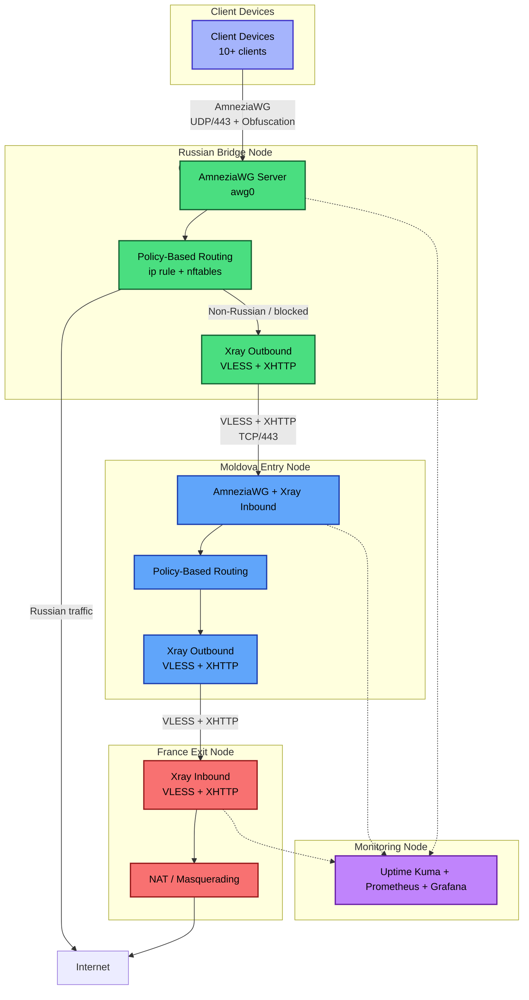
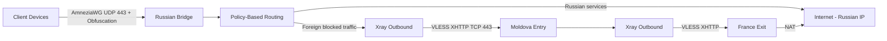

## Overview

This project is a **censorship-resistant multi-hop VPN infrastructure** designed to provide stable, private and high-performance internet access in environments with aggressive Deep Packet Inspection (DPI) and whitelist-based network restrictions.

## Key Features

- **Three-hop chain** with intelligent routing
- **Policy-Based Routing** on the Russian Bridge node (selective routing: Russian services go directly, blocked/foreign traffic goes through full chain)
- Strong obfuscation using **AmneziaWG** + **Xray (VLESS + XHTTP)**
- Full automation (Ansible, Python provisioning scripts)
- Modern observability stack

The architecture allows clients to connect once to the Russian Bridge and automatically receive optimal routing: low latency for Russian services and maximum bypass capability for everything else.

**Current status**: Moldova Entry node is fully operational. Russian Bridge and France Exit nodes are in the provisioning phase.

## Architecture v2 – High-Level Diagram



### Node Roles

| Node                | Location                  | Status              | Primary Role                                                                 | Key Technologies |
|---------------------|---------------------------|---------------------|------------------------------------------------------------------------------|------------------|
| **Russian Bridge**  | Russia (Saint Petersburg / Moscow) | In provisioning     | First hop for all clients. Accepts obfuscated connections and performs **Policy-Based Routing**. | AmneziaWG (UDP/443), Xray (VLESS+XHTTP), nftables + ip rule |
| **Moldova Entry**   | Moldova (Chișinău)        | Fully operational   | Intermediate hop. Currently also serves as fallback for clients.             | AmneziaWG, Xray (inbound + outbound) |
| **France Exit**     | France (Paris)            | In provisioning     | Final hop. Provides European exit IP and NAT to the internet.                | Xray (VLESS + XHTTP) |
| **Monitoring**      | Netherlands (planned)     | Planned             | Centralized observability and alerting.                                      | Uptime Kuma, Prometheus, Grafana, Alertmanager |

> **Important note**: After the Russian Bridge is activated, all clients will be migrated to connect exclusively through it. Direct connections to the Moldova node will remain only as a backup.

### Client Connectivity

- **Current (interim)**: Clients connect directly to the Moldova Entry Node via AmneziaWG (UDP/443). Works reliably over Wi-Fi and, under relaxed restrictions, over mobile networks.
- **Target**: Clients will connect to the **Russian Bridge Node** using AmneziaWG. Traffic will then traverse the full three-hop chain.

All client configurations include obfuscation parameters (`Jc`, `Jmin`, `Jmax`, `H1`–`H4`) and `MTU = 1280` for maximum stability.

### Key Design Decisions

| Decision                          | Why Chosen                                                                 | Benefit |
|-----------------------------------|----------------------------------------------------------------------------|---------|
| **Three-hop chain**               | Maximum resistance to blocking and Deep Packet Inspection (DPI)            | Extremely difficult to fully block |
| **Russian Bridge as first hop**   | Strategic placement in Russia to increase the chance of successful connection in networks with strict **whitelist-based restrictions** (theoretical approach, currently being validated in practice) | Higher probability of bypassing ISP allowlists |
| **Policy-Based Routing on Bridge**| Intelligent traffic splitting: Russian services go directly, foreign or blocked traffic goes through the full three-hop chain | Optimal balance between speed and bypass capability |
| **AmneziaWG + Xray (VLESS+XHTTP)**| Combination of strong UDP obfuscation and TCP traffic that mimics legitimate HTTPS | High resilience against DPI and traffic throttling |
| **Server-side selective routing** | All routing logic is handled on the server side                            | Users need only one AmneziaWG profile for optimal experience across all devices |
| **Ansible + Python automation**   | Full Infrastructure as Code approach                                       | Easy to maintain, scale and reproduce |

**Result**: Users connect once to the Russian Bridge and automatically receive the best possible routing — low latency for Russian services and reliable bypass for international and blocked resources.

##  Data Flows & Packet Processing



### Detailed Flows

- **Client → Russian Bridge**

```
Client → AmneziaWG (UDP/443, obfuscated) → Russian Bridge (awg0)
          ↓
     Policy-Based Routing (nftables + ip rule)
          ↓
   ├── Russian destinations → Direct exit (Russian IP)
   └── Non-Russian / blocked → Xray Outbound → Moldova
```

- **Internal Hops**

`Russian Bridge (Xray) → VLESS + XHTTP (TCP/443) → Moldova Entry`
`Moldova Entry (Xray)  → VLESS + XHTTP (TCP/443) → France Exit`

- **Final Exit**

`France Exit → NAT (Masquerading) → Internet (European IP)`

- **Key Advantage**

> All selective routing happens on the server (Russian Bridge). The client only needs to connect a single AmneziaWG profile — the system automatically chooses the optimal path: low latency for Russian services and maximum censorship circumvention for everything else.

## Technology Stack & Rationale

| Technology                  | Purpose                                      | Why Chosen |
|-----------------------------|----------------------------------------------|------------|
| **AmneziaWG**               | Client-to-bridge VPN tunnel                  | Fork of WireGuard with built-in strong obfuscation. Excellent resistance to DPI while maintaining low overhead. |
| **Xray (VLESS + XHTTP)**    | Internal hops and final exit                 | TCP-based protocol that mimics legitimate HTTPS traffic. Very high resilience against deep packet inspection and throttling. |
| **Policy-Based Routing** (nftables + ip rule) | Intelligent traffic splitting on Russian Bridge | Allows Russian services to exit directly (low latency) while routing blocked/foreign traffic through the full chain. |
| **3X-UI**                   | Xray management panel                        | Convenient web interface for managing inbounds, clients, and Let's Encrypt certificates. |
| **Uptime Kuma + Prometheus + Grafana** | Monitoring and observability            | Modern, lightweight, and extensible stack for real-time metrics, alerting, and dashboards. |
| **Ansible + Python**        | Infrastructure automation                    | Full IaC approach for consistent, repeatable and version-controlled deployments. |
| **Docker**                  | Isolation of monitoring components           | Simplifies deployment and maintenance of observability stack. |

This combination was deliberately chosen to achieve the best balance between **obfuscation strength**, **performance**, and **maintainability**.

## Monitoring and Observability

The project implements a comprehensive monitoring stack to ensure high availability and quick incident response.

### Current State

Monitoring is currently hosted on the **Moldova Entry Node**:

| Component              | Purpose                                      | Implementation |
|------------------------|----------------------------------------------|----------------|
| **Uptime Kuma**        | Service availability and alerting            | Ping, SSH, TCP/443 (Xray), push monitor from `check_awg.sh` |
| **Prometheus + Node Exporter** | System metrics collection               | CPU, RAM, disk, network, load average |
| **Alertmanager**       | Intelligent alerting                         | Telegram notifications based on Prometheus rules |
| **Custom checks**      | AmneziaWG health monitoring                 | `check_awg.sh` (handshake age, peer status) |

### Planned Improvements

- Migration of the entire monitoring stack to a **dedicated VPS in the Netherlands** to isolate it from VPN traffic.
- Grafana dashboards for real-time visualization.
- Blackbox exporter for external UDP/443 connectivity tests.
- Custom Prometheus exporter for AmneziaWG metrics (handshake age, traffic per peer, etc.).

This setup allows proactive monitoring and fast reaction to any issues in the multi-hop chain.

## Security Considerations

The infrastructure is designed with security and operational safety in mind from the ground up.

### Access Control
- **SSH**: Key-based authentication only. Password authentication is disabled.
- **UFW Firewall**: Only strictly necessary ports are open:
  - `22/tcp` (SSH) — restricted by source IP where possible
  - `443/udp` (AmneziaWG)
  - `443/tcp` (Xray)
  - Monitoring ports (restricted by IP)

### Service Hardening
- **3X-UI** management panel: Default credentials changed immediately. HTTPS via Let's Encrypt is recommended.
- **AmneziaWG keys**: Never exposed outside the servers. Stored securely on each node.
- **Principle of least privilege**: Services run with minimal required permissions.

### Network Security
- All internal hops between nodes use encrypted Xray (VLESS + XHTTP) tunnels.
- No unnecessary services or open ports on any node.
- KillSwitch is enabled on the client side (AmneziaVPN).

### Operational Security
- Regular key rotation planned.
- Monitoring of unauthorized access attempts via fail2ban (planned).
- Dedicated monitoring node (future) will further isolate observability from the VPN data plane.

**Security model**: Defense-in-depth approach combining strong encryption, obfuscation, strict firewall rules, and infrastructure isolation.

## Planned Extensions & Automation

The project is designed with modularity and automation in mind, allowing easy scaling and maintenance.

### Near-term Plans

- **Russian Bridge Node** — full deployment and activation (currently in provisioning phase)
- **France Exit Node** — automated deployment via existing Python script (Aeza provider)
- **Policy-Based Routing** — final implementation and testing of selective routing on the Russian Bridge
- **Monitoring Migration** — move the entire observability stack to a dedicated VPS in the Netherlands

### Automation & Infrastructure as Code

| Component              | Tool                  | Status      | Purpose |
|------------------------|-----------------------|-------------|---------|
| VPS Provisioning       | Python scripts        | In progress | Automated creation of VPS via 4VPS.SU and Aeza APIs |
| Configuration Management | Ansible             | In progress | Consistent deployment of AmneziaWG, Xray and monitoring |
| CI/CD                  | GitHub Actions (planned) | Planned | Linting, testing and validation of scripts |
| Custom Metrics         | Prometheus exporter   | Planned | AmneziaWG-specific metrics (handshake age, peers, traffic) |
| Failover Mechanism     | Residential proxies   | Planned | Automatic exit IP rotation |

### Long-term Vision

- Integration of residential proxy pool for dynamic exit IP rotation
- Blackbox exporter for external connectivity testing
- Full GitOps workflow for infrastructure management
- Custom health-check system for the entire multi-hop chain

The ultimate goal is to transform this infrastructure into a fully automated, self-healing and easily maintainable platform.

## References
- [AmneziaWG Official Documentation](https://amnezia.org/)
- [AmneziaWG GitHub](https://github.com/amnezia-vpn/amneziawg)
- [Xray Core](https://github.com/XTLS/Xray-core)
- [3X-UI Panel](https://github.com/mhsanaei/3x-ui)
- [Uptime Kuma](https://github.com/louislam/uptime-kuma)
- [Prometheus](https://prometheus.io/)
- [WireGuard Protocol](https://www.wireguard.com/)
- [nftables](https://wiki.nftables.org/)

## Project Status

- **Moldova Entry Node**: Fully operational, serving 6+ client devices
- **Russian Bridge Node**: In provisioning phase (waiting for provider details)
- **France Exit Node**: Ready for automated deployment
- **Policy-Based Routing**: Implemented on test level, full rollout after Russian Bridge activation
- **Monitoring**: Currently on Moldova node, migration to dedicated Netherlands VPS planned

---

**Next Steps** (as of April 2026):
- Activate Russian Bridge and migrate all clients
- Implement and test full Policy-Based Routing
- Complete monitoring migration
- Add GitHub Actions for CI/CD