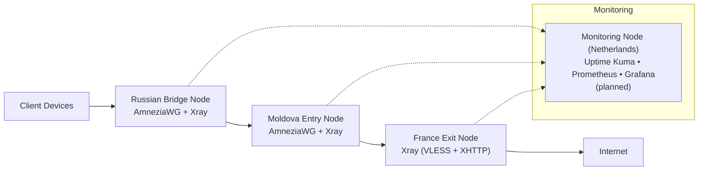

# Multi-Hop Obfuscated VPN Infrastructure Architecture

## 1. Introduction

This document describes the architecture of a multi-hop VPN infrastructure designed to provide stable, private and censorship-resistant internet access in environments with Deep Packet Inspection (DPI) and potential whitelist-based network restrictions.

The system is built as a **three-hop chain**:

1. **Russian Bridge Node** – first hop for clients, located in a Russian data center with an IP that is likely to remain in whitelists.
2. **Moldova Entry Node** – second hop, receives traffic from the bridge and forwards it to the exit node.
3. **France Exit Node** – final hop, provides a European exit IP and connects to the global internet.

A dedicated monitoring node (planned in the Netherlands) collects metrics and sends alerts. The architecture is modular, which allows easy replacement of any node, automated deployment and future extensions (additional proxies, failover paths).

## 2. Target Architecture

The target setup consists of four VPS instances:
- Russian Bridge
- Moldova Entry (currently fully operational)
- France Exit
- Netherlands Monitoring (planned)

### 2.1. High-Level Diagram



### 2.2. Node Roles

| Node               | Location                  | Primary Role                                              | Protocols |
|--------------------|---------------------------|-----------------------------------------------------------|-----------|
| **Russian Bridge** | Russia (Saint Petersburg / Moscow) | First hop for clients. Accepts obfuscated client connections and forwards traffic to Moldova. | AmneziaWG (UDP/443) inbound<br>Xray outbound to MD |
| **Moldova Entry**  | Moldova (Chișinău)        | Intermediate hop. Receives traffic from the bridge, performs routing/NAT and forwards to France. Currently hosts the monitoring stack and serves 6 client devices directly (interim). | AmneziaWG (UDP/443)<br>Xray (inbound from RU, outbound to FR) |
| **France Exit**    | France (Paris)            | Final hop. Provides European exit IP to the global internet. | Xray (VLESS + XHTTP) inbound from MD |
| **Monitoring**     | Netherlands (planned)     | Centralized observability and alerting.                   | HTTP/HTTPS, Prometheus scraping |

> **Note**: After the Russian bridge becomes active, direct client connections to Moldova will be phased out (or kept as a fallback). The 6 existing clients will be migrated to connect via the Russian node.

### 2.3. Client Connectivity

- **Current (interim)**: Clients connect directly to the Moldova Entry Node via AmneziaWG (UDP/443). Works reliably over Wi-Fi and, under relaxed restrictions, over mobile networks.
- **Target**: Clients will connect to the **Russian Bridge Node** using AmneziaWG. Traffic will then traverse the full three-hop chain.

All client configurations include obfuscation parameters (`Jc`, `Jmin`, `Jmax`, `H1`–`H4`) and `MTU = 1280` for maximum stability.

## 3. Technology Stack & Rationale

| Technology                  | Purpose                                      | Why Chosen |
|-----------------------------|----------------------------------------------|------------|
| **AmneziaWG**               | Client-to-bridge VPN tunnel                  | WireGuard fork with built-in obfuscation. Strong DPI resistance and low overhead. |
| **Xray (VLESS + XHTTP)**    | Internal hops and final exit                 | TCP-based protocol that mimics legitimate HTTPS traffic. Excellent resilience against throttling and blocking. |
| **3X-UI**                   | Xray management and client generation        | User-friendly web panel with Let's Encrypt support and multi-protocol capabilities. |
| **Uptime Kuma**             | Service monitoring and alerting              | Lightweight, supports push monitors and Telegram notifications. |
| **Prometheus + Node Exporter** | System metrics collection                 | Industry-standard observability stack. |
| **Docker**                  | Isolation of monitoring components           | Simplifies deployment, updates and maintenance. |

## 4. Data Flows

### 4.1. Client → Russian Bridge
```
Client (Wi-Fi / mobile) → AmneziaWG (UDP/443) → Russian Bridge → Xray outbound
```

### 4.2. Internal Hops
```
Russian Bridge (Xray) → TCP/443 (VLESS + XHTTP) → Moldova Entry (Xray) → TCP/443 (VLESS + XHTTP) → France Exit
```

### 4.3. Exit → Internet
```
France Exit → NAT → Internet
```

## 5. Monitoring and Observability (Current State)

The monitoring stack currently runs on the Moldova node:
- **Uptime Kuma** – ping, SSH, Xray port (TCP/443) and push monitor from `check_awg.sh` (cron job checking AmneziaWG handshakes).
- **Prometheus + Node Exporter** – CPU, RAM, disk, network metrics.
- **Alertmanager** – Telegram alerts based on Prometheus rules (high CPU, low disk, node unreachable, etc.).

**Planned**: Full migration to a dedicated VPS in the Netherlands to isolate monitoring from VPN traffic.

## 6. Security Considerations

- SSH: key-based authentication only, password authentication disabled.
- UFW: only required ports open (22, 443/UDP, 443/TCP, monitoring ports). Monitoring ports can be further restricted by source IP.
- 3X-UI panel: change default `admin/admin` credentials immediately; use Let's Encrypt for HTTPS.
- AmneziaWG keys: stored only on the servers and never exposed.
- Future: dedicated monitoring node will create an additional security boundary.

## 7. Planned Extensions & Automation

- **Russian Bridge provisioning** – Python script + 4VPS.SU API (waiting for support reply with DC/tariff IDs). Fallback providers: Beget or FirstVDS.
- **France Exit** – automated via existing Aeza Python script (ready).
- **Configuration management** – Ansible playbooks for AmneziaWG, Xray and monitoring.
- **Monitoring** – dedicated NL node + Grafana dashboards + Blackbox exporter.
- **Failover** – residential proxy pool (e.g. Germany) for automatic exit IP rotation.
- **Custom exporter** – Prometheus exporter for AmneziaWG metrics (handshake age, peer count, traffic).

## 8. References

- [AmneziaWG](https://amnezia.org/)
- [3X-UI](https://github.com/mhsanaei/3x-ui)
- [Uptime Kuma](https://github.com/louislam/uptime-kuma)
- [Prometheus](https://prometheus.io/)
- [WireGuard](https://www.wireguard.com/)
