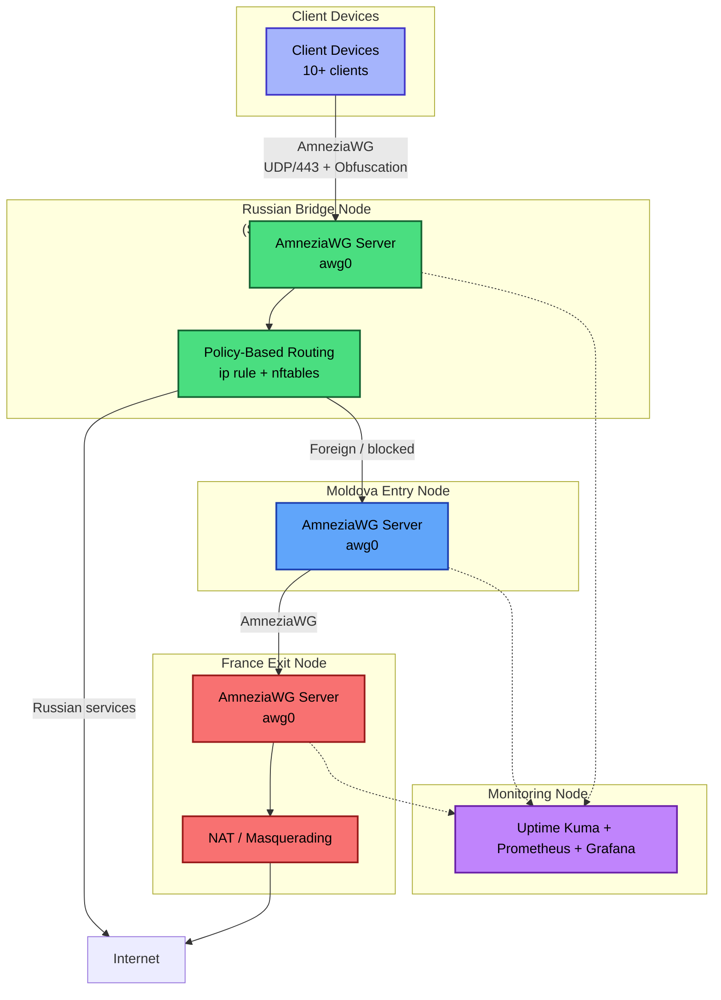
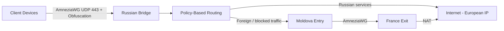

### Overview

This project implements a **censorship-resistant multi-hop VPN** designed to provide stable, private and high-performance internet access in environments with aggressive Deep Packet Inspection (DPI) and whitelist-based network restrictions.

**Key Features:**
- Three-hop chain (Russia → Moldova → France) with intelligent routing
- **Policy-Based Routing** on the Russian Bridge (selective routing)
- **Primary protocol**: AmneziaWG (a WireGuard fork with built‑in obfuscation) on all hops – fast, lightweight, and resilient to DPI
- **Fallback protocol** (optional): Xray (VLESS+Reality or VLESS+XHTTP) for clients where AmneziaWG is blocked (e.g., UDP‑restricted mobile networks)
- Full automation via Ansible and Python scripts
- Modern observability stack

Clients connect once to the Russian Bridge and automatically receive the optimal path: low latency for Russian services and maximum bypass for foreign/blocked resources.

**Current Status**: Moldova Entry node is fully operational (AmneziaWG). Russian Bridge and France Exit nodes are in the provisioning phase.

## Architecture v2 – High-Level Diagram

The core of the infrastructure is a **three‑hop chain** built entirely on **AmneziaWG** (a WireGuard fork with built‑in obfuscation).  
All internal traffic between the nodes (Russia → Moldova → France) is encrypted and routed via AmneziaWG over UDP/443.  
Clients connect to the Russian Bridge using AmneziaWG as well.

> **Fallback protocol (optional):** For clients that cannot use AmneziaWG (e.g., UDP‑restricted mobile networks), Xray (VLESS+Reality or VLESS+XHTTP) can be offered as an alternative. However, Xray is **not** part of the main multi‑hop chain.

## Node Roles

| Node                | Location                  | Status              | Primary Role                                                                 | Key Technologies |
|---------------------|---------------------------|---------------------|------------------------------------------------------------------------------|------------------|
| **Russian Bridge**  | Russia (Saint Petersburg / Moscow) | In provisioning     | First hop for clients. Accepts obfuscated connections and performs **Policy-Based Routing**. | AmneziaWG (UDP/443), nftables + ip rule |
| **Moldova Entry**   | Moldova (Chișinău)        | Fully operational   | Intermediate hop. Forwards traffic between Russia and France.                | AmneziaWG (UDP/443) |
| **France Exit**     | France (Paris)            | In provisioning     | Final hop. Provides European exit IP and NAT to the internet.                | AmneziaWG (UDP/443), NAT |
| **Monitoring**      | Netherlands (planned)     | Planned             | Centralized observability and alerting.                                      | Uptime Kuma, Prometheus, Grafana, Alertmanager |

> **Fallback protocol (optional):** For clients that cannot use AmneziaWG (e.g., due to UDP restrictions), Xray (VLESS+Reality or VLESS+XHTTP) can be deployed on the Russian Bridge and Moldova Entry as an alternative. It is **not** part of the main multi‑hop chain and does not affect the performance of the primary AmneziaWG tunnel.

### Client Connectivity

- **Current (interim)**: Clients connect directly to the Moldova Entry Node via AmneziaWG (UDP/443). Works reliably over Wi-Fi and, under relaxed restrictions, over mobile networks.
- **Target**: Clients will connect to the **Russian Bridge Node** using AmneziaWG. Traffic will then traverse the full three-hop chain.

All client configurations include obfuscation parameters (`Jc`, `Jmin`, `Jmax`, `H1`–`H4`) and `MTU = 1280` for maximum stability.

> **Optional fallback for UDP‑restricted networks**: If a client cannot use AmneziaWG (e.g., because the mobile operator blocks UDP), Xray (VLESS+Reality or VLESS+XHTTP) can be offered as an alternative. This fallback does **not** affect the main multi‑hop chain and is provided only for compatibility.

### Key Design Decisions

| Decision                          | Why Chosen                                                                 | Benefit |
|-----------------------------------|----------------------------------------------------------------------------|---------|
| **Three-hop chain**               | Maximum resistance to blocking and Deep Packet Inspection (DPI)            | Extremely difficult to fully block |
| **Russian Bridge as first hop**   | Strategic placement in Russia to increase the chance of successful connection in networks with strict **whitelist-based restrictions** (theoretical approach, currently being validated in practice) | Higher probability of bypassing ISP allowlists |
| **Policy-Based Routing on Bridge**| Intelligent traffic splitting: Russian services go directly, foreign or blocked traffic goes through the full three-hop chain | Optimal balance between speed and bypass capability |
| **AmneziaWG as primary protocol** | Fast, lightweight WireGuard fork with built‑in obfuscation; less overhead than Xray, better performance | Low latency, high throughput, resilience against DPI |
| **Xray as optional fallback**     | For clients where UDP is blocked (e.g., some mobile networks)              | Provides alternative access without complicating the main chain |
| **Server-side selective routing** | All routing logic is handled on the server side                            | Users need only one AmneziaWG profile for optimal experience across all devices |
| **Ansible + Python automation**   | Full Infrastructure as Code approach                                       | Easy to maintain, scale and reproduce |

**Result**: Users connect once to the Russian Bridge and automatically receive the best possible routing — low latency for Russian services and reliable bypass for international and blocked resources.

## Data Flows & Packet Processing

### High‑Level Traffic Flow

### Detailed FLows

**Client → AmneziaWG (UDP/443, obfuscated) → Russian Bridge (awg0)**
          ↓
     Policy-Based Routing (nftables + ip rule)
          ↓
   ├── Russian destinations → Direct exit (Russian IP)
   └── Non-Russian / blocked → AmneziaWG → Moldova Entry

- **Internal Hops**

`Russian Bridge → AmneziaWG (UDP/443) → Moldova Entry`
`Moldova Entry  → AmneziaWG (UDP/443) → France Exit`

- **Final Exit**

`France Exit → NAT (Masquerading) → Internet (European IP)`

- **Key Advantage**

> All selective routing happens on the server (Russian Bridge). The client only needs to connect a single AmneziaWG profile — the system automatically chooses the optimal path: low latency for Russian services and maximum censorship circumvention for everything else.

## Technology Stack & Rationale

| Technology                  | Purpose                                      | Why Chosen |
|-----------------------------|----------------------------------------------|------------|
| **AmneziaWG**               | Primary VPN protocol for all hops (client → bridge → entry → exit) | Fork of WireGuard with built‑in strong obfuscation. Excellent resistance to DPI while maintaining low overhead and high throughput. |
| **Policy-Based Routing** (nftables + ip rule) | Intelligent traffic splitting on Russian Bridge | Allows Russian services to exit directly (low latency) while routing blocked/foreign traffic through the full chain. |
| **Xray (VLESS+Reality / VLESS+XHTTP)** | **Optional fallback** for clients that cannot use AmneziaWG (e.g., UDP‑restricted mobile networks) | Provides a TCP‑based alternative that mimics legitimate HTTPS traffic. Not part of the primary multi‑hop chain. |
| **3X-UI**                   | Management panel for Xray (fallback)         | Convenient web interface for managing inbounds, clients, and certificates. Only needed if fallback is enabled. |
| **Uptime Kuma + Prometheus + Grafana** | Monitoring and observability            | Modern, lightweight, and extensible stack for real‑time metrics, alerting, and dashboards. |
| **Ansible + Python**        | Infrastructure automation                    | Full IaC approach for consistent, repeatable and version‑controlled deployments. |
| **Docker**                  | Isolation of monitoring components           | Simplifies deployment and maintenance of observability stack. |

This combination was deliberately chosen to achieve the best balance between **obfuscation strength**, **performance**, and **maintainability**. The primary chain uses only AmneziaWG, keeping latency low and throughput high. Xray is reserved for edge cases where UDP is blocked.

## Monitoring and Observability

The monitoring stack is currently hosted on the **Moldova Entry Node** (a dedicated VPS in the Netherlands is planned for the future).

| Component                      | Purpose                                         | Implementation |
|--------------------------------|-------------------------------------------------|----------------|
| **Uptime Kuma**                | Service availability and alerting               | Ping, SSH, push monitor from `awg_status.py` |
| **Prometheus + Node Exporter** | System metrics (CPU, RAM, disk, network)       | Collects metrics from all nodes |
| **Alertmanager**               | Alert routing and deduplication                 | Sends critical alerts (node down, high CPU, low disk, handshake failure) to Telegram |
| **Custom Python script** (`awg_status.py`) | AmneziaWG health monitoring | Runs via cron, checks handshake age, peer count, traffic, and pushes data to Uptime Kuma |

All components are containerised with Docker for easy deployment and maintenance.

### Planned Improvements

- Migration of the entire monitoring stack to a **dedicated VPS in the Netherlands** to isolate it from VPN traffic.
- Grafana dashboards for real-time visualization.
- Blackbox exporter for external UDP/443 connectivity tests.
- Custom Prometheus exporter for AmneziaWG metrics (handshake age, traffic per peer, etc.).

This setup allows proactive monitoring and fast reaction to any issues in the multi-hop chain.

## Security Considerations

The infrastructure is designed with security and operational safety in mind from the ground up.

### Access Control
- **SSH**: Key‑based authentication only. Password authentication is disabled.
- **UFW Firewall**: Only strictly necessary ports are open:
  - `22/tcp` (SSH) — restricted by source IP where possible
  - `443/udp` (AmneziaWG on all nodes)
  - Monitoring ports (restricted by IP)

### Service Hardening
- **AmneziaWG keys**: Never exposed outside the servers. Stored securely on each node.
- **Principle of least privilege**: Services run with minimal required permissions.
- **Optional Xray fallback** (if deployed): Its web panel (3X‑UI) would require default credential change and HTTPS via Let's Encrypt.

### Network Security
- All internal hops between nodes use encrypted **AmneziaWG** tunnels (UDP/443).
- No unnecessary services or open ports on any node.
- KillSwitch is enabled on the client side (AmneziaVPN).

### Operational Security
- Regular key rotation planned.
- Monitoring of unauthorized access attempts via fail2ban (planned).
- Dedicated monitoring node (future) will further isolate observability from the VPN data plane.

**Security model**: Defense‑in‑depth approach combining strong encryption, obfuscation, strict firewall rules, and infrastructure isolation.

## Planned Extensions & Automation

The project is designed with modularity and automation in mind, allowing easy scaling and maintenance.

### Near-term Plans

- **Russian Bridge Node** — full deployment and activation (currently in provisioning phase)
- **France Exit Node** — automated deployment via existing Python script (Aeza provider)
- **Policy-Based Routing** — final implementation and testing of selective routing on the Russian Bridge
- **Monitoring Migration** — move the entire observability stack to a dedicated VPS in the Netherlands

### Automation & Infrastructure as Code

| Component              | Tool                  | Status      | Purpose |
|------------------------|-----------------------|-------------|---------|
| VPS Provisioning       | Python scripts        | In progress | Automated creation of VPS via YandexCloud and Terraform |
| Configuration Management | Ansible             | In progress | Consistent deployment of AmneziaWG and monitoring |
| CI/CD                  | GitHub Actions (planned) | Planned | Linting, testing and validation of scripts |
| Custom Metrics         | Prometheus exporter   | Planned | AmneziaWG-specific metrics (handshake age, peers, traffic) |
| Failover Mechanism     | Residential proxies   | Planned | Automatic exit IP rotation |

### Long-term Vision

- Integration of residential proxy pool for dynamic exit IP rotation
- Blackbox exporter for external connectivity testing
- Full GitOps workflow for infrastructure management
- Custom health-check system for the entire multi-hop chain

The ultimate goal is to transform this infrastructure into a fully automated, self-healing and easily maintainable platform.

## References

> **Note:** The primary protocol is AmneziaWG. The Xray and 3X-UI references below are for the optional fallback setup.

- [AmneziaWG Official Documentation](https://amnezia.org/)
- [AmneziaWG GitHub](https://github.com/amnezia-vpn/amneziawg)
- [Xray Core](https://github.com/XTLS/Xray-core) (optional fallback)
- [3X-UI Panel](https://github.com/mhsanaei/3x-ui) (optional fallback)
- [Uptime Kuma](https://github.com/louislam/uptime-kuma)
- [Prometheus](https://prometheus.io/)
- [WireGuard Protocol](https://www.wireguard.com/)
- [nftables](https://wiki.nftables.org/)

## Project Status

- **Moldova Entry Node**: Fully operational (AmneziaWG), serving 10+ client devices
- **Russian Bridge Node**: Terraform module for Yandex Cloud ready and validated, awaiting provisioning
- **France Exit Node**: Terraform module for Aeza ready and validated, awaiting provisioning
- **Policy-Based Routing**: Implemented on test level, full rollout after Russian Bridge activation
- **Monitoring**: Currently on Moldova node, migration to dedicated Netherlands VPS planned

**Next Steps** (as of April 2026):
- Activate Russian Bridge and migrate all clients
- Implement and test full Policy-Based Routing
- Complete monitoring migration
- Add GitHub Actions for CI/CD